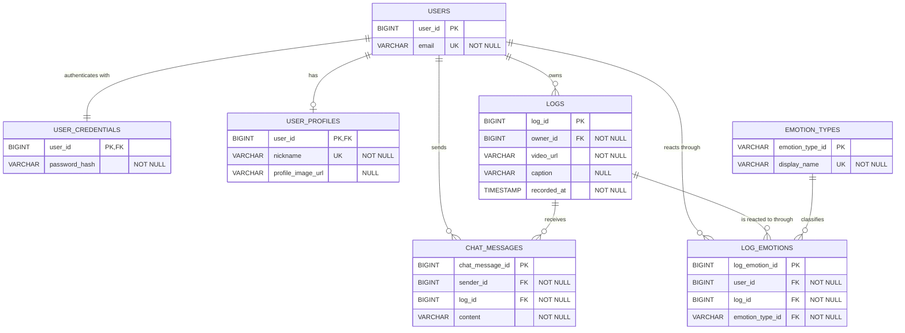

# KOLOG Normalized Entity Relationship Diagram

현재 JPA 엔티티의 도메인 의미를 유지하면서 정규화한 **목표 스키마**다.
현재 코드와 그대로 일치하는 스키마가 아니라, 엔티티 및 마이그레이션 시 적용할
개선안이다.



## 정규화 포인트

- `UserInfo`를 `USER_PROFILES`로 분리하고 인증 정보는
  `USER_CREDENTIALS`로 분리해 계정, 인증, 프로필의 책임을 나눴다.
- 기존 `date` 문자열과 `hour` 정수를 하나의 원자적인 `recorded_at`으로 합쳤다.
  날짜나 시간대별 조회는 이 컬럼에서 계산하거나 인덱스를 사용한다.
- 반복 저장되던 `emotion_id` 문자열은 `EMOTION_TYPES` 코드 테이블에서 한 번만
  관리한다.
- 사용자와 로그 사이의 **채팅 다대다 관계**는 내용(payload)을 갖는 연결 엔티티
  `CHAT_MESSAGES`로 해소했다.
- 사용자와 로그 사이의 **감정 다대다 관계**는 감정 종류를 함께 참조하는 연결
  엔티티 `LOG_EMOTIONS`로 해소했다.
- `LOGS.owner_id`는 로그 작성자 관계이며, 채팅/감정 연결 테이블의 사용자 관계와
  의미가 다르므로 별도의 1:N 관계로 유지한다.
- 무결성을 위해 모든 FK를 `NOT NULL`로 강화했다. 연결 대상 없이 채팅이나 감정만
  존재하는 고아 레코드를 허용하지 않는다.

## 권장 제약 조건과 인덱스

Mermaid 속성 문법으로 정확히 표현하기 어려운 복합 제약 조건은 DB에 별도로
적용한다.

```sql
ALTER TABLE log_emotions
    ADD CONSTRAINT uk_log_emotions_user_log_type
    UNIQUE (user_id, log_id, emotion_type_id);

CREATE INDEX idx_logs_owner_recorded_at
    ON logs (owner_id, recorded_at);

CREATE INDEX idx_chat_messages_log
    ON chat_messages (log_id, chat_message_id);

CREATE INDEX idx_log_emotions_log
    ON log_emotions (log_id, emotion_type_id);
```

> 한 사용자가 로그마다 감정을 하나만 선택해야 한다면 `LOG_EMOTIONS`의 유니크
> 제약을 `(user_id, log_id)`로 변경한다.
